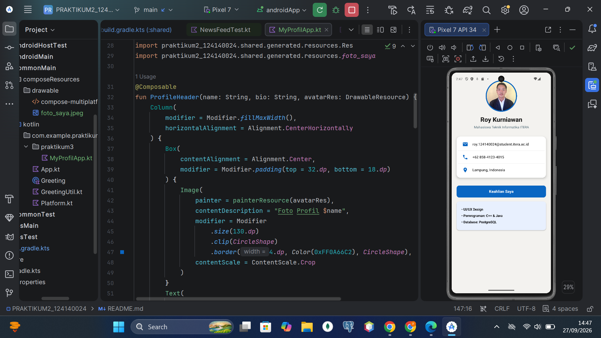

# Tugas Praktikum 2 - News Feed Simulator

**Nama:** Roy Kurniawan  
**NIM:** 124140024  

---

## Cara Menjalankan Program

1. Buka file `NewsFeedTest.kt` yang berada di dalam folder:
   `composeApp/src/commonTest/kotlin/com/example/praktikum2_124140024/`
2. Klik ikon panah hijau (*Run*) di sebelah kiri baris `@Test fun runSimulator()`.
3. Pilih **Run**.
4. Hasil output program akan langsung muncul pada tab **Run** di panel bawah Android Studio.

---

## Tugas Praktikum 3 - My Profile App

**Screenshot Aplikasi:**

